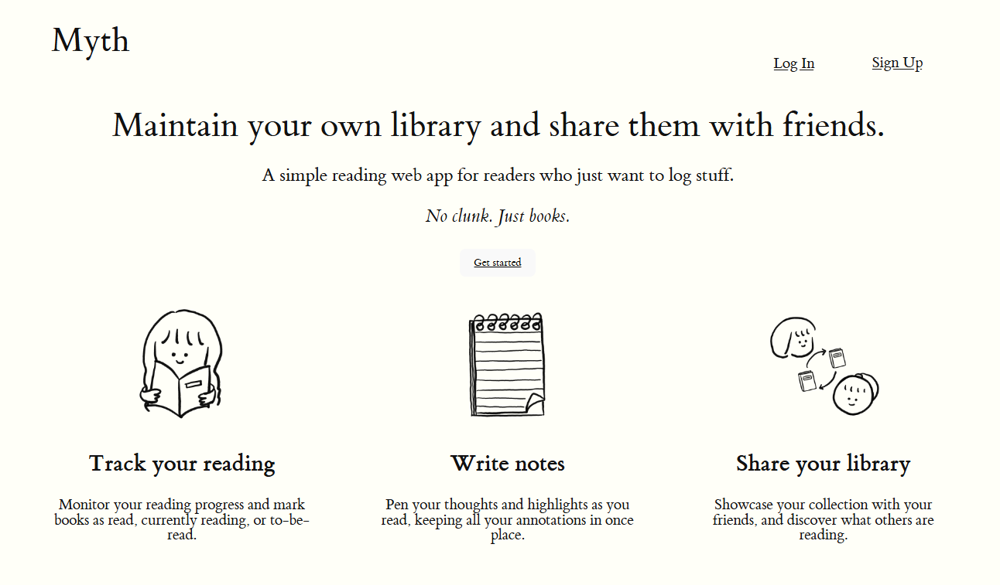
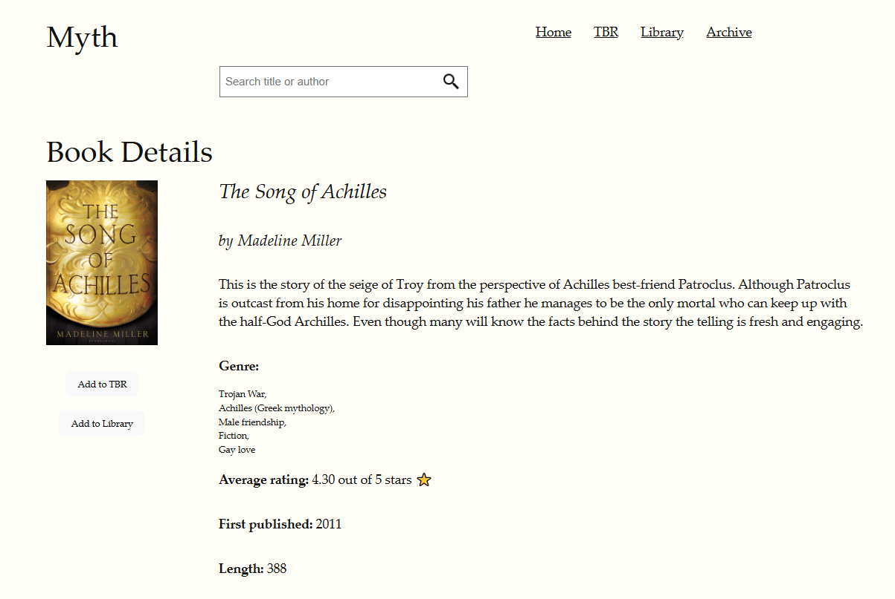
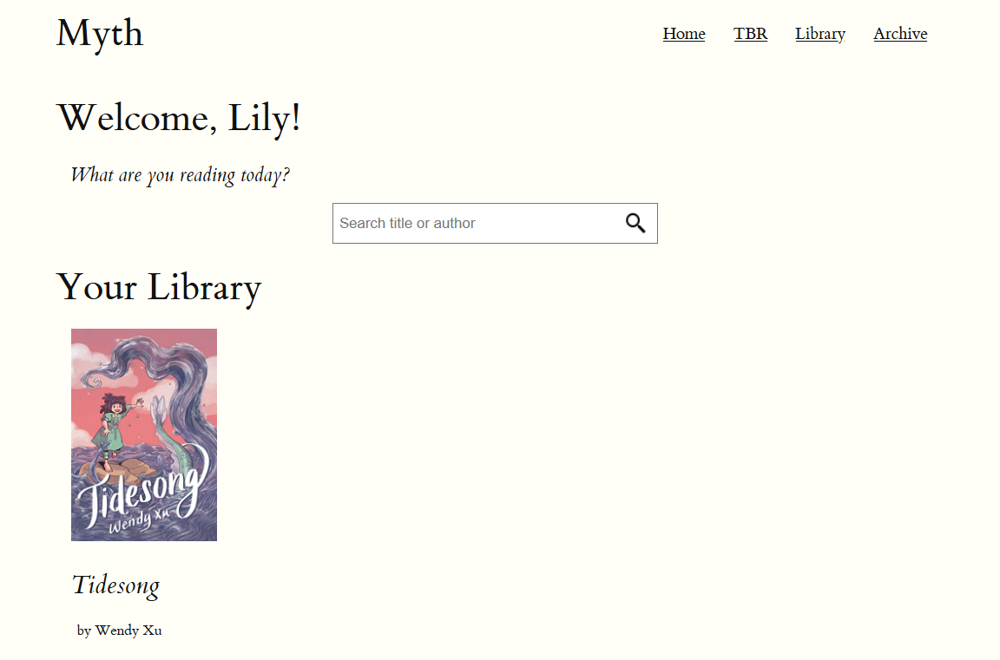

# Myth

Myth aspires to be like Goodreads and StoryGraph without all the clutter of having to fill up a lengthy questionnaire about each book before you can mark them as read.

**A simple reading web app**

As an avid reader myself, I religiously keep track of the books I read and use apps like Goodreads to store them.

While some readers might find joy in filling up the post-reading questionnaire and leaving lengthy reviews, I find this experience very noisy. There's just too much going on.

**Myth - The Book App**

Myth targets readers who desire a simplified experience of the book tracking app.

There are only three shelves: your TBR, your current library, and your archive of read books.

In addition to tracking your reading progress, Myth desires to provide two more features - writing notes and sharing your library.

In fulfillment of the second coding bootcamp project to build a React application with partial/full CRUD, I have completed one of the features.

## Getting Started

Begin your reading journey by "logging in" to your account and search for books by title or author.

Add titles to the respective shelves: TBR for to-be-read, library for your current reads, and archive for read books, and update when you're done!

See how I planned this app [here](https://miro.com/app/board/uXjVKrudW3Y=/?share_link_id=385691609527).

## Attributions & Credits

- [Tufte.css](https://edwardtufte.github.io/tufte-css/)
- [Open Library Search API](https://openlibrary.org/dev/docs/api/search)
- [Airtable](https://airtable.com/)
- Icons8

## Technologies Used

HTML, CSS, JavaScript, React, Airtable

## Next Steps

- Optimise CSS and code functions

- Build note-taking and library-sharing feature

- Utilise other Book APIs
